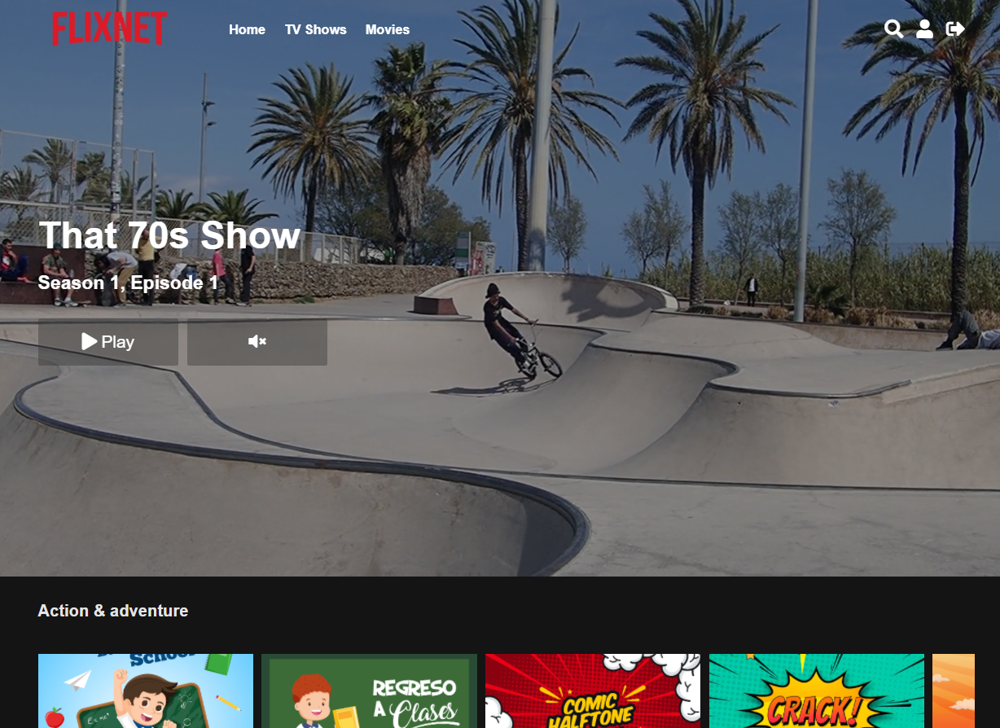

---
Made with 💗 by: [mflores-](https://github.com/mariav7)

## Personal project - Flixnet a Netflix clone

This app was built using [PHP](https://www.php.net/manual/en/intro-whatis.php), [AJAX](https://developer.mozilla.org/en-US/docs/Web/Guide/AJAX), [MYSQL](https://www.mysql.com/), [JavaScript](https://developer.mozilla.org/en-US/docs/Web/JavaScript), [HTML](https://developer.mozilla.org/en-US/docs/Web/HTML) and [CSS](https://developer.mozilla.org/en-US/docs/Web/CSS).

## ✨ NOTE: 👉Coded for Recreational Purposes
This project was developed for recreational purposes and serves as a hands-on experience and first-time usage of AJAX.

---

## Supported feautures

* Available Pages:
  * Public Routes:
    * Login
    * Sign up
  * Private Routes:
    * Dashboard
    * User profile
* Database Handling: the app utilizes MySQL to manage the database (not provided)

---

## Screenshots

### Home

  

### Dashboard

  

### Login

  

---